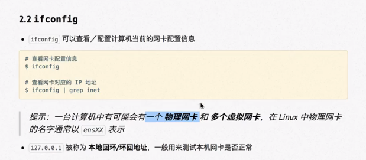
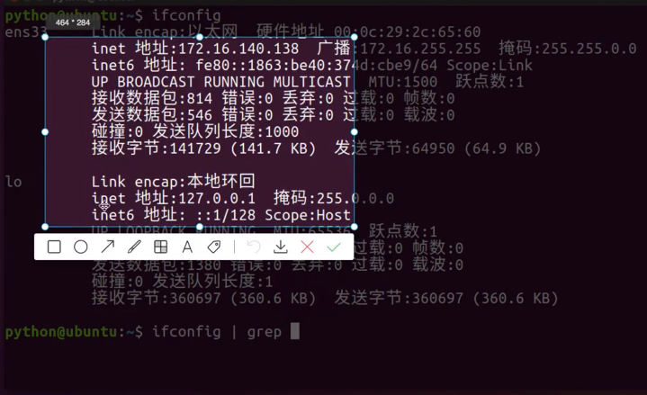
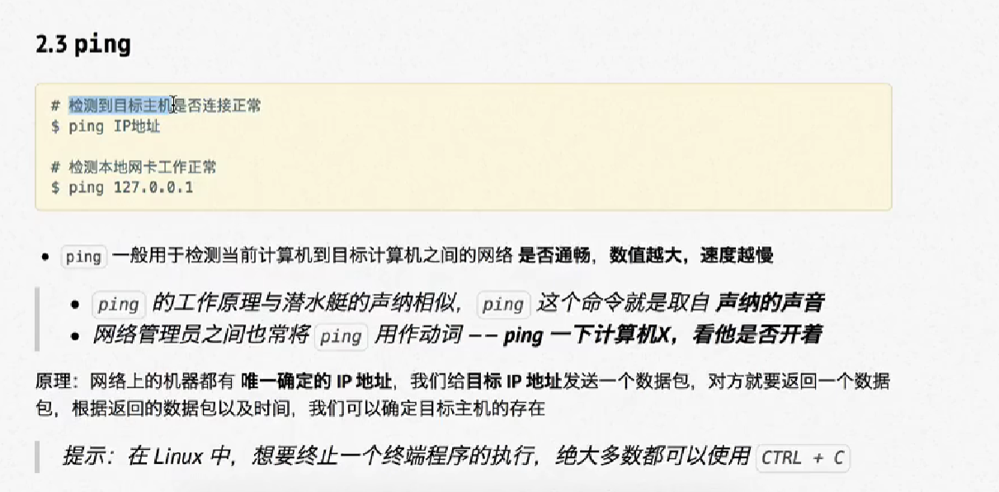
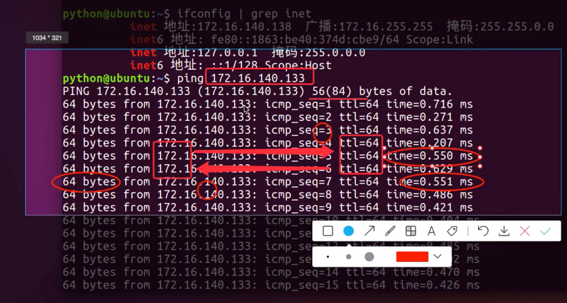
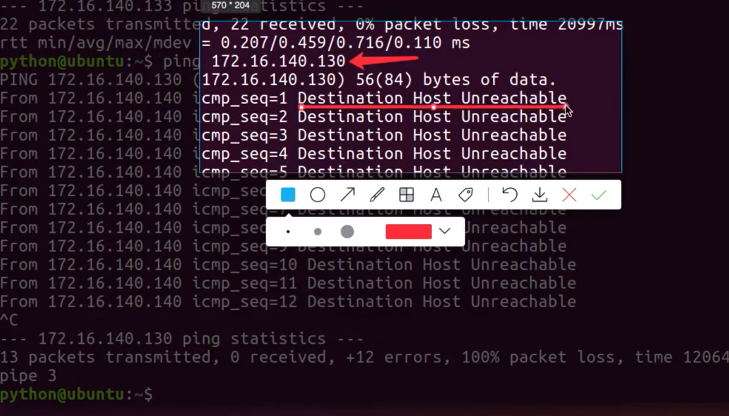
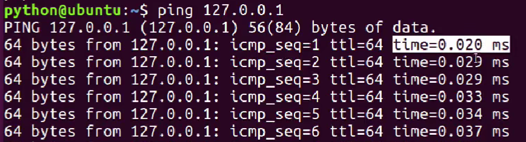
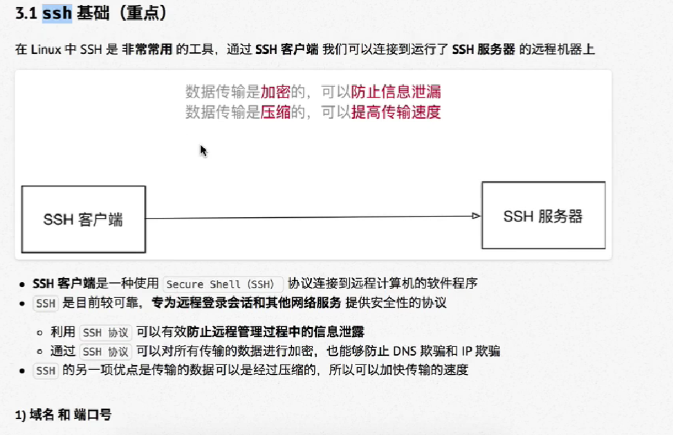
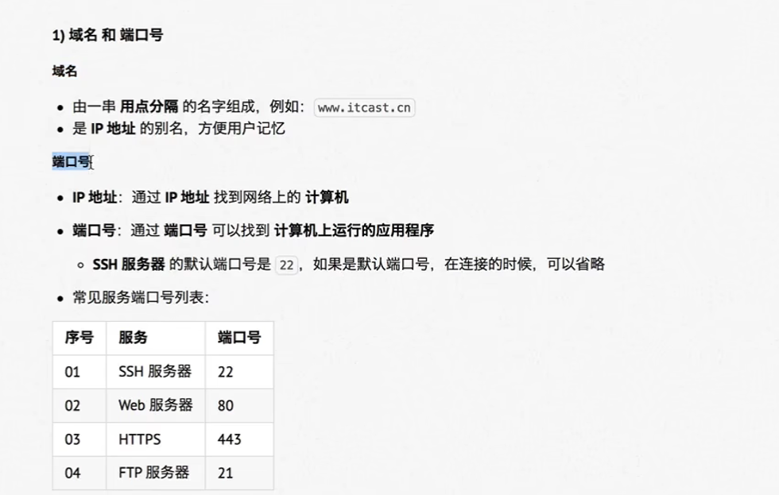

# Liunx

## 远程管理文件命令：
 * ifconfig (查看网卡配置信息)
 

* | (管道)将前面的输出结果当成后面命令的输入。 
* grep (过滤信息) +想过滤的搜索的文本

## ping 命令

* ping命令的工作原理：当你发送数据包给目标主机的时候，目标主机接收到数据包之后会给我们一个反向的回值，还会记录一下时间，当时间越小的时候说明网速越快，时间越大的时候说明网速越慢
* 以下是知道IP的时候，输出的结果

* 如果是不知道ip的情况或者错误的IP时,会发生报错。告诉我们目标主机无法到达，说明两台主机它们之间并没有正确的网络连接
* 输入一个错误的ip回车后并没有立刻显示结果而是等了一下会显示三行。按下Ctrl+C终止的时候会出现目标主机无法到达，

## 检测本地网卡工作是否正常
* 实际上只需要把IP地址换成本地回环/环回地址``127.0.0.1`` 就可以了

* 网络请求的时间0.20ms ，有正常的回馈时间就说明本地网卡工作是正常的

# SSH基础、

 

 

