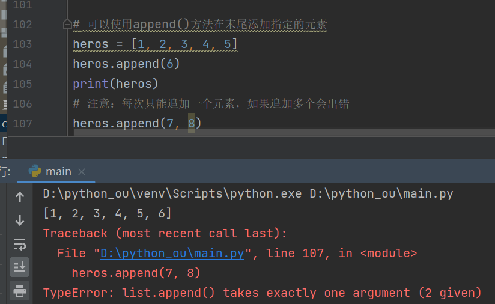
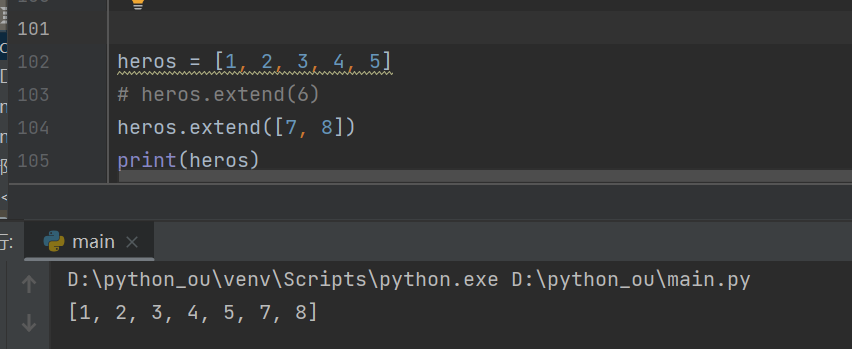

# Python笔记

## 列表

Python的列表与Java、C的数组的意思是一样的，不同的是它几乎可以存储所有类型的数据


**创建列表**

不同元素之间使用逗号分隔例如：

```Python
x = [1, 2, 3]
```

一个列表是可以存放多种数据类型的例如：

```Python
x = [1, 1.1, 'string', '中文'] 
```

这样的列表就包含了3种内存类型

而列表中的每一个元素都有自己的序列，序列是从0开始与元素一一对应。通过序列的办法可以做到单独访问列表中的某一个数值

这是一个列表，他们的索引值对应为:
```PYthon
x = [1, 1.1, 'string', '中文']
#     0,   1,     2,       3
```
这里再附上一个图


| 元素 | 1 | 2 |3|4|5|'上山打老虎'|
|:--:|:--:|:--:|:--:|:--:|:--:|:--:|
| 下标 | 0 | 1 |2|3|4|5|
这就是列表中每个元素所对应的序列。而通过序列访问列表中元素的方法叫做下标索引具体操作如下

例如：
```Python
x = [1, 1.1, 'string', '中文']
print(x[1])
# 结果：1.1
# 打印出来的结果是列表中序列为1的元素也就是列表中的第二个元素（因为是从0开始计数）
```

**列表切片**

*切片是为了获得序列某个区间的元素序列。切片操作通过使用单个冒号和两个冒号分隔来实现

例如：
```python
a = [1, 2, 3, 4, 5, 6]
print(a[:]) # 取全部元素
print(a[0:]) # 从0开始取全部元素
print(a[::2])  # 从0开始隔一个取一个元素,第二个冒号是设置列表的跨度值
```
>运行结果是:`[1, 2, 3, 4, 5, 6]`
>>>>>`[1, 2, 3, 4, 5, 6]`

>>>>>`[1, 3, 5]`


当然还可以倒序输出，也可以视为翻转操作

例如：
```python
flag = "}382e73d6b4404d28419512e5da451b46{galf"
print(flag[::-1])
```
>运行结果是：`flag{64b154ad5e21591482d4044b6d37e283}`


**当然列表最常用的操作就是增、删、改、查和切片操作**
**1.增**

可以使用append()方法在末尾添加指定的元素
```python
heros = [1,2,3,4,5]
heros.append(6)
```
>运行结果是：`[1, 2, 3, 4, 5, 6]`

**<span style="color: rgb(255, 41, 65);">注意：每次只能追加一个元素，如果追加多个会出错</span>**

**例如：**

`


当然使用extend()方法可以连续在原列表里的最后一个元素添加多个元素

**例如：**



在任意位置添加数据或插入元素可用insert()方法
```python
s = [1, 3, 4, 5]
s.insert(1, 2)
print(s)
```
>运行结果是：`[1, 2, 3, 4, 5]`

如果是len(s)那么就在列表末尾插入,就相当于append()方法
```python
s = [1, 3, 4, 5]
s.insert(len(s), 6)
print(s)
```
>运行结果是：`[1, 3, 4, 5, 6]`

**2、删除列表的删除方式有4种，del直接删、pop()删、remove()方法，清空clear, **

**①del()方法直接删**
```python
s = [1, 2, 3, 4]
del s[2]
print(s)
```
>运行结果是：`[1, 3, 4]`

**②pop()删**：
```python
s = [1, 2, 3, 4]
s.pop(0)
print(s)
```
>运行结果是：`[2, 3, 4]`

**③remove()：根据列表的值来删**
```python
s = [1, 2, 3, 4, 5]
s.remove(3)
print(s)
```
>运行结果是：`[1, 2, 4, 5]`

**④清空clear()，清空顾名思义就是删除所有**
```python
s = [1, 2, 3, 4, 5]
s.clear()
print(s)
```
>运行结果是：`[]`
