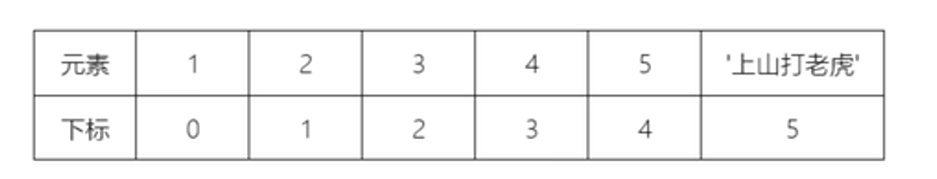

# Python笔记

## 列表

Python的列表与Java、C的数组的意思是一样的，不同的是它几乎可以存储所有类型的数据


**创建列表**

不同元素之间使用逗号分隔例如：

```Python
x = [1, 2, 3]
```

一个列表是可以存放多种数据类型的例如：

```Python
x = [1, 1.1, 'string', '中文'] 
```

这样的列表就包含了3种内存类型

而列表中的每一个元素都有自己的序列，序列是从0开始与元素一一对应。通过序列的办法可以做到单独访问列表中的某一个数值

这是一个列表，他们的索引值对应为:
```PYthon
x = [1, 1.1, 'string', '中文']
#     0,   1,     2,       3
```
这里再附上一个图




这就是列表中每个元素所对应的序列。而通过序列访问列表中元素的方法叫做下标索引具体操作如下

例如：
```Python
x = [1, 1.1, 'string', '中文']
print(x[1])
# 结果：1.1
# 打印出来的结果是列表中序列为1的元素也就是列表中的第二个元素（因为是从0开始计数）
```
