## phpMailer任意i代码执行漏洞分析过程
* 1：查找漏洞点（$params , 会被攻击手控制了，所以可以写入任何文件） 

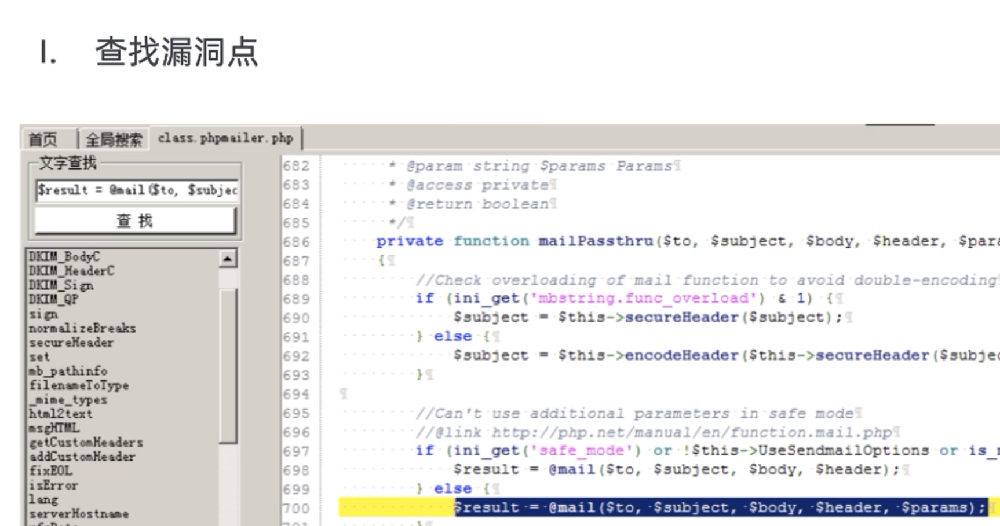

* 2：函数朔源，找到过滤点（去看函数的回溯看它调用了哪些参数或数据）

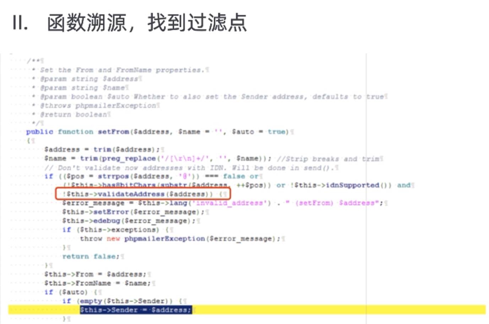

* 3.分析正则表达式(过滤点) 绕过方法
* 4.手工调试正则表达式

## 查缺补漏
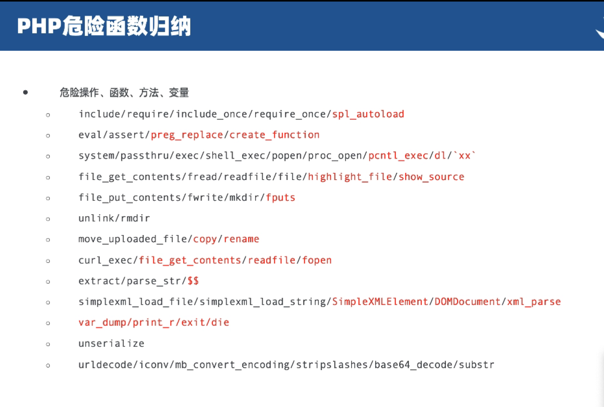

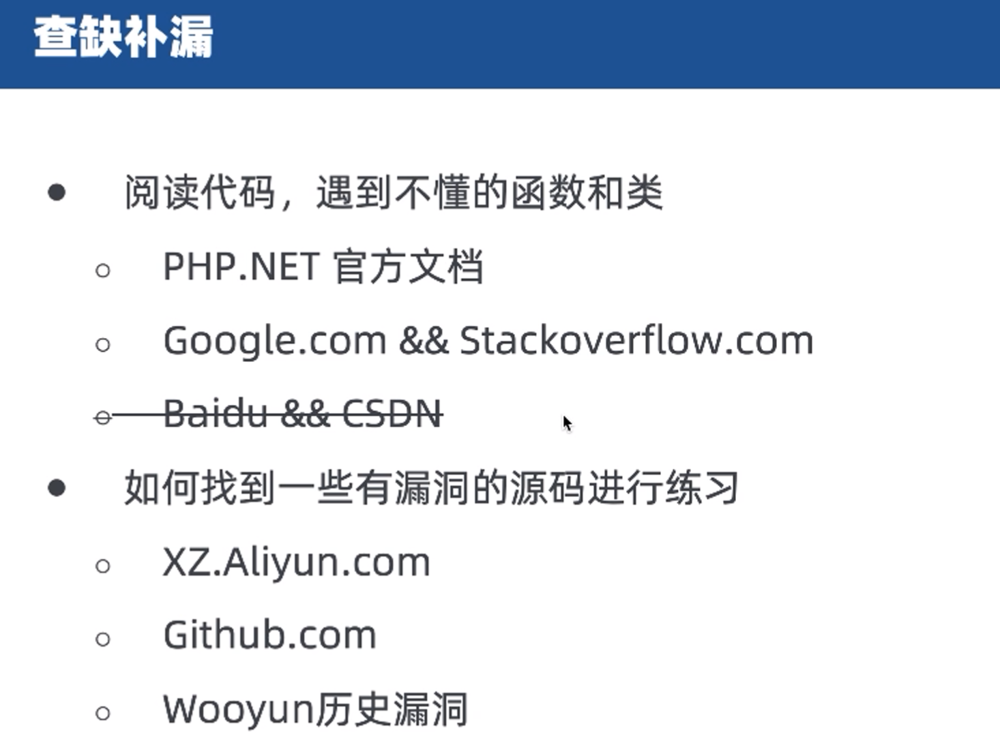

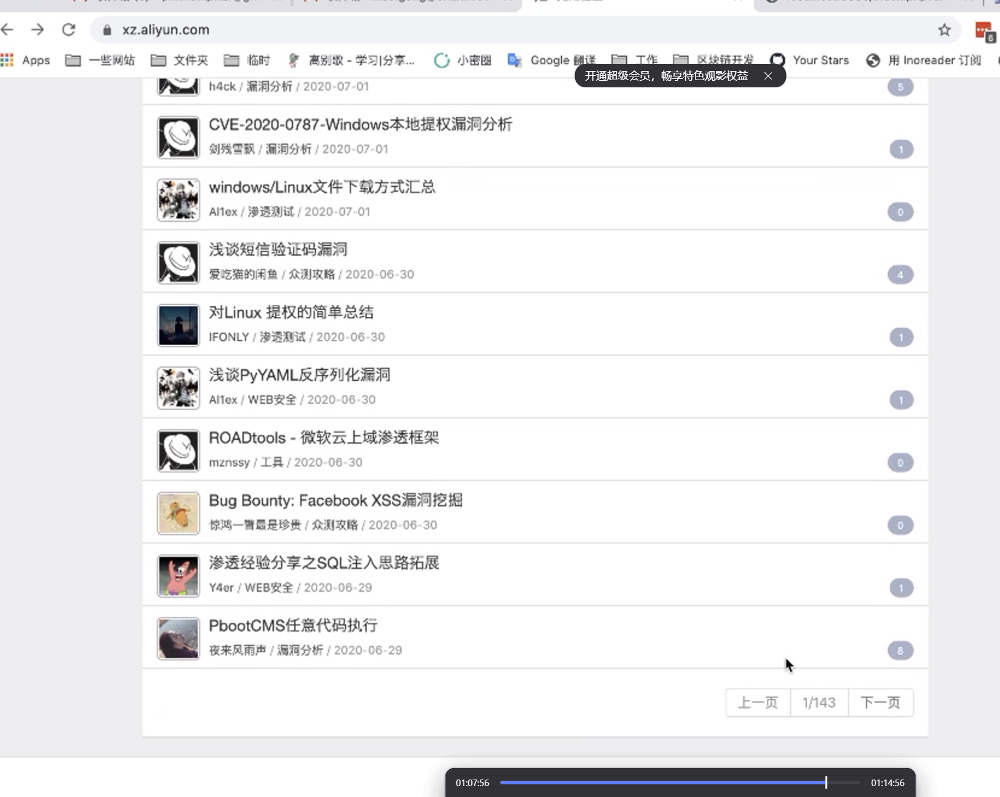

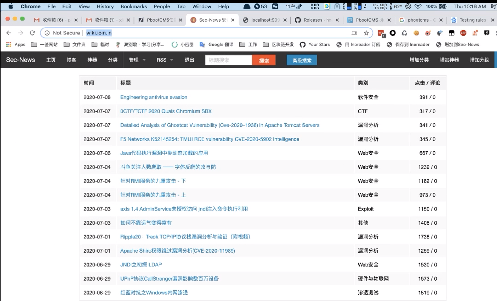

# sql注入

* 反向查找
1.通过可控变量(也就是输入点)回溯危险函数
2.查找危险函数确定可控变量
3.传递的过程中触发漏洞

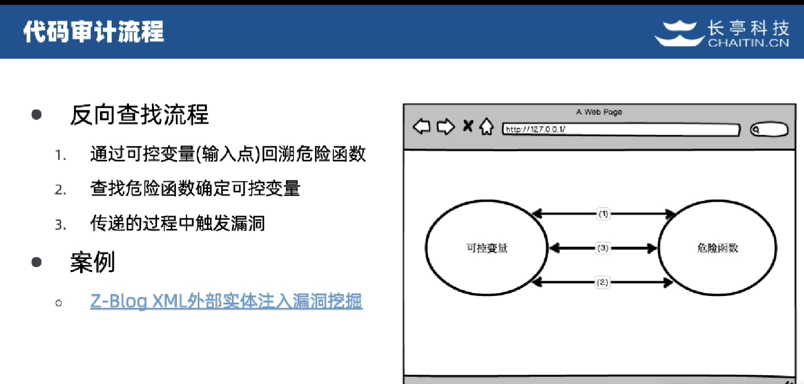

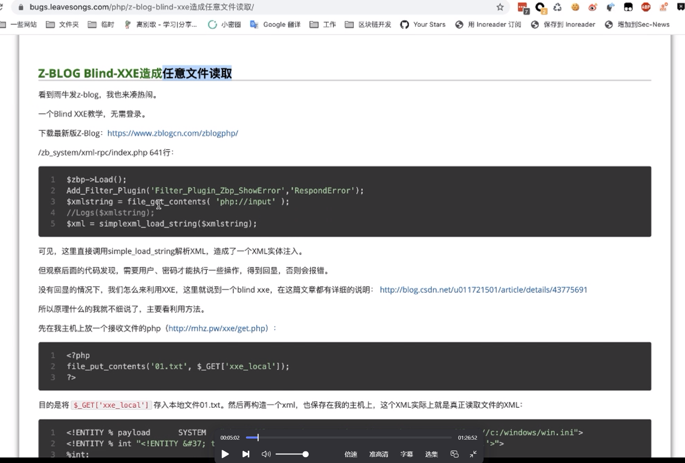

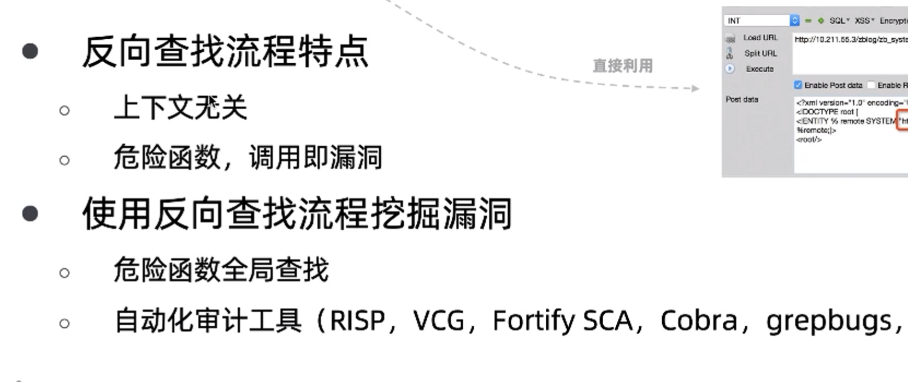

## 反向漏洞挖掘特点
* 根源：危险函数导致的漏洞
* 特点：
1.暴力:全局搜索危险函数
2.简单：无需过多理解目标网站功能与架构
3.快速：适用于自动化代码审计工具
4.命中率低：简单的漏洞越来越少
5.无法挖掘逻辑漏洞：逻辑漏洞多数不存在危险函数，或危险函数的参数
6.适用性较差：不适合存在全局过滤的站点

## 正向漏洞挖掘特点
* 正向查找流程
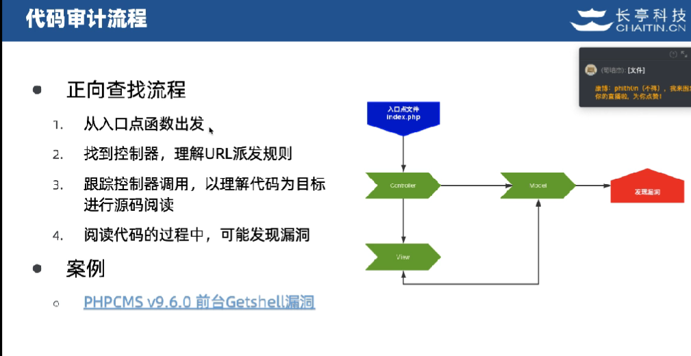

* 根源：程序员疏忽或逻辑问题导致漏洞
* 特点：
1.复杂：需要及其了解目标源码的功能与架构
2.跳跃性大：涉及M/V/C/Service/Dao等多个层面
3.漏洞的组合：通常是多个漏洞的组合，很可能存在逻辑相关的漏洞
4.潜力无限：安全研究人员的宝库

## 双向漏洞挖掘特点
* 根源：理解程序执行过程，寻找危险逻辑
* 特点：
1.高校：如挖掘隧道，双向开工，时间减半
2.知识面广：需要同时掌握正向，反向挖掘技巧，并进行结合，以及所有正向，反向的优点

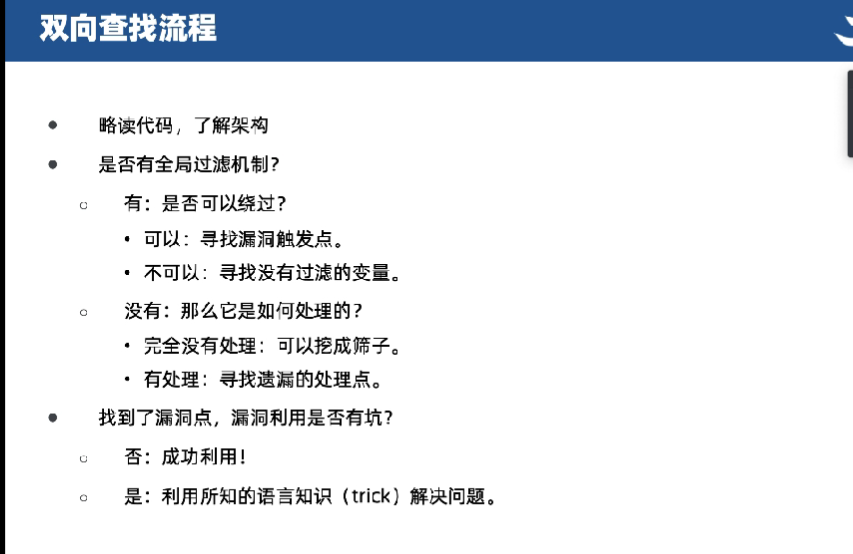
  

  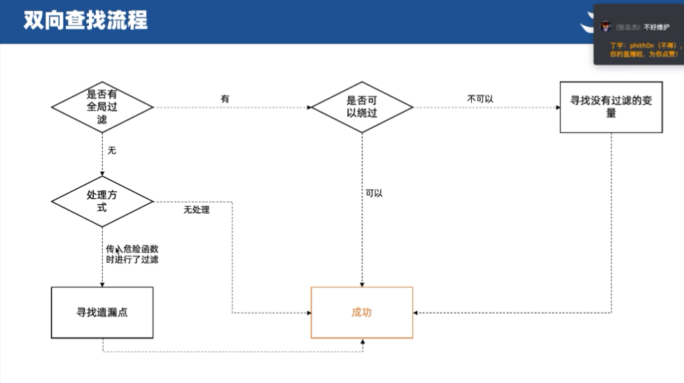

# 技巧
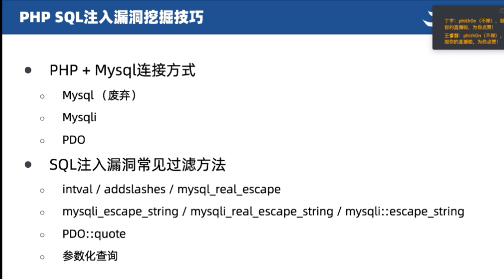
* 如
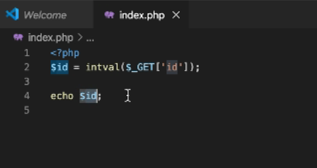

