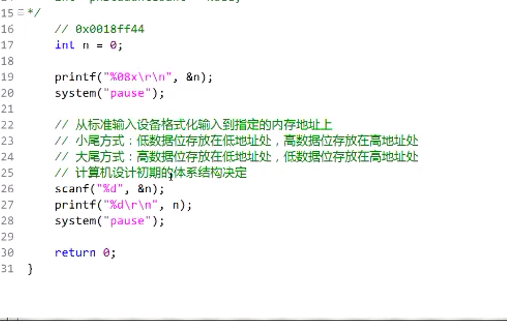

## 逆向
**1：printf有三个变量分别是：**
* 功能stdout(格式化输出到标准输出设备，默认是显示器也可以说是屏幕)
* stdin(标准输入对象，默认是键盘)
* stderr(标准错误对象，默认是显示器，屏幕)

**2.printf也存在返回值，例如：**
```C
// --run--
int a = printf("Hello world\r\n");
printf("%d\r\n", a);
```
>运行结果是：`Hello world`, `14`

# 变量命名规范
```C
例如：
int nStudentCount = 0;
float fStudentCount = 0.0f
double dblStudentCount = 0.0;
char cStudengCount = '\0';
short int snStudengCount = 0;
int *pnStudengCount = NULL;

```


## * scanf从标准输入设备格式化到指定的内存地址上
* ``scanf(%d, &n)`` ,%d意思是存入的字符是整形(int),&n是取变量n的地址




